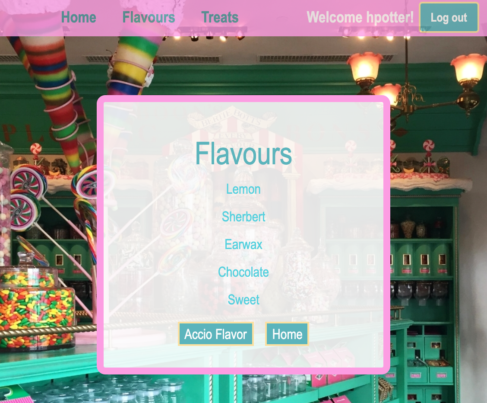

# **Honeydukes**

### _Advanced Databases and Authentication - Week 12 Project at Epicodus_

#### Author: **_Jessica Hvozdovich_**
#### June 5, 2020



### Description

_This application accepts authenticated users' input to display different Flavors and Treats available at a magical candy store. The purpose of this project is to create a C# web application that employs a database with a many-to-many relationship using MySQL and Entity Framework. Identity is also used to support user authentication and authorization. It also demonstrates the use of MVC routes that follow RESTful conventions for full CRUD functionality._

### Instructions for use:

1. Open Terminal (macOS) or PowerShell (Windows)
2. To download the project Directory to your desktop enter the following commands:
```
cd Desktop
git clone https://github.com/jhvozdovich/candy-store.git
cd candy-store (or the file name you created for the main Directory of the download)
```
3. To view the downloaded files, open them in a text editor or IDE of your choice.
* if you have VSCode for example, when your terminal is within the main project Directory you can open all of the files with the command:
```
code .
```
4. Create a file within the Honeydukes folder named appsettings.json.
5. Add the following code:
```
{
  "ConnectionStrings": {
    "DefaultConnection": "Server=localhost;Port=3306;database=jessica_hvozdovich;uid=root;pwd=YOURMYSQLPASSWORDHERE;"
  }
}
```
* Add your MySQL password and make any other changes needed if you have an alternative server, port, or uid selected. These are the default settings.

#### If you need to install and configure MySQL:
1. Download the MySQL Community Server DMG file [here](https://dev.mysql.com/downloads/file/?id=484914) with the "No thanks, just start my download" link.
2. On the configuration page of the installer select the following options:
* Use legacy password encryption
* Set your password
3. Open the terminal and enter the command:
*'export PATH="/usr/local/mysql/bin:$PATH"' >> ~/.bash_profile
4. Download the MySQL Workbench DMG file [here](https://dev.mysql.com/downloads/file/?id=484391)
5. Open Local Instance 3306 with the password you set.

#### To create a local version of the database:
1. Open a terminal within your text editor or IDE.
2. Navigate to the Honeydukes folder with the following command:
```
cd Honeydukes
```
3. Run the following command to recreate the project's database structure:
```
dotnet ef database update
```
4. Verify that the database structure is present by refreshing the MySQL workbench schemas. There should now be a directory for jessica_hvozdovich.

#### To run the program:
To install the necessary dependencies and start a local host, after replicating the database run the following commands:
```
dotnet restore
dotnet build
dotnet run
```

### Known Bugs

No bugs have been identified at the time of this update.
Passwords requirements are currently reduced for testing.

### Support and Contact Information

Please contact me with any suggestions or questions at jhvozdovich@gmail.com. Thank you for your input!  
_Have a bug or an issue with this application? [Open a new issue](https://github.com/jhvozdovich/candy-store/issues) here on GitHub._

### Technologies Used

* C#
* `ASP.NET` Core
* `ASP.NET` Core MVC
* Entity Framework Core
* `ASP.NET` Core Identity
* MySQL
* Git and GitHub

### Specs
| Spec | Input | Output |
| :------------- | :------------- | :------------- |
| **User enters home page** | User Input:"URL: localhost:5000/" | Output: “Welcome!” |
| **User can navigate to a page that lists Flavors** | User Input:"Click: View Flavors" | Output: “Fruitti, Cherry, Earwax” |
| **If no Flavors have been added a message appears** | User Input:"Click: View Flavors" | Output: “You have no Flavors listed! Accio Flavors!” |
| **User can navigate to an Add Flavors form** | User Input:"Click: Accio Flavor" | Output: “Create a new Flavor.” |
| **User can fill out the Add Flavors form** | User Input:"Enter New Flavor Name: Lemon" | Output:  Flavors: Fruitti, Cherry, Earwax, Lemon” |
| **User can submit an Edit Flavors form** | User Input:"Click: Reparo Lemon" | Output: “Name: Lemon" |
| **User can click on Flavors to view the Treats available with that Flavor** | User Input:"Click: Earwax" | Output: “Treats: Bertie Bott's Every Flavour Beans” |
| **If no Treats have been added a message appears** | User Input:"Click: View Treats" | Output: “You have no Treats listed. Accio Treats!” |
| **User can navigate to a create new Treat with a form** | User Input:"Click: Accio Treat" | Output: “Treat Form" |
| **User can delete a Flavor** | User Input:"Click: Reducto!" | Output: “You have removed this Flavor!” |
| **User can navigate to a page that lists Treats** | User Input:"Click: View Treats" | Output: “Fruitti, Cherry, Earwax” |
| **If no Flavors have been added a message appears** | User Input:"Click: View Flavors" | Output: “You have no Flavors listed! Accio Flavors!” |
| **User can add a new Treat linked to a Flavor** | User Input:"Treat Name: Fizzing Whizzbees, Flavor: Sherbert, Price: 2 Sickles" | Output: “Sherbert Treats: Bertie Bott's Every Flavour Beans, Fizzing Whizzbees” |
| **User can view Treat details when clicked** | User Input:"Click: Fizzing Whizzbees" | Output: “Treat Details: "Name: Fizzing Whizzbees, Flavor: Sherbert, Price: 2 Sickles” |
| **User can submit an Edit Treat form** | User Input:"Click: Reparo Fizzing Whizzbees" | Output: “Treat Details: "Name: Fizzing Whizzbees, Flavor: Sherbert, Price: 2 Sickles" |
| **User can delete a Treat** | User Input:"Click: Reducto!" | Output: “You have removed this Treat!” |
| **User can add additional Flavors to a Treat** | User Input:"Click: Accio Fizzing Whizzbees Flavor" | Output: “Add Flavor Form” |
| **User can register** | User Input:"Username: hpotter Name: Harry Password: 3Xp3LL1@rmu5" | Output: “Home Page” |
| **User can Login** | User Input:"Username: hpotter Password: 3Xp3LL1@rmu5" | Output: “Welcome Harry” |
| **User must be logged in to perform actions that are not readonly** | User Input:"Username: hpotter Name: Harry Password: 3Xp3LL1@rmu5" | Output: “Welcome Harry” |
| **User can Logout** | User Input:"Click: Logout" | Output: “Greetings Muggle!” |

### Stretch Goals
| Spec | Input | Output |
| :------------- | :------------- | :------------- |
| **Patron class without editing permission** | User Input:"Click: View Flavors" | Output: “Create/Delete/Update buttons not displayed” |
| **Patron can register** | User Input:"Click: Register" | Output: “Registration form - Patron” |
| **Patron can fill out registration information** | User Input:"Username: hpotter Name: Harry Password: 3Xp3LL1@rmu5" | Output: “Welcome Harry” |
| **Admin can fill out registration information** | User Input:"Username: aFlume Name: Ambrosius Password: LemonDr0p!" | Output: “Welcome Ambrosius” |
| **Patron can purchase a treat** | User Input:"Treat: Chocolate Frogs" | Output: “That will be 3 Sickles!” |
| **Purchase Treat options are only available to signed in Patrons** | User Input:"Click: purchase a treats" | Output: “You must make an account!” |


### Resources
* (Background Image)[http://www.uofanguide.com/honeydukes]
* (Logo)[https://www.character.com/products/harry-potter-honeydukes-sweatshirt?variant=19128224251966]

#### License

This software is licensed under the MIT license.

Copyright © 2020 **_Jessica Hvozdovich_**
